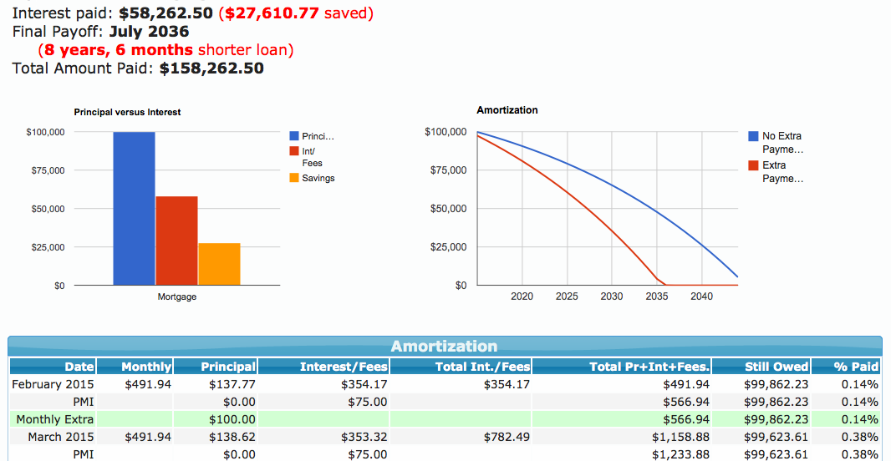
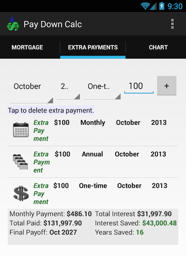

# Pay Down Calc
[Pay Down Calc](http://paydowncalc.com)
 is an open source extra-payment mortgage calculator with charts and graphs. It has a native (not quite as capable) Android version too.

## Live Demo Web
http://PayDownCalc.com/

## Build Instructions - Web

The web version of Pay Down Calc was written entirely in JavaScript --just clone drop in to a web site and go. It connects to the Google Chart engine to provide the graphs.

### Features

- Annual, Monthly, One-time extra payments
- Saved time and money
- Refinance Estimates
- Cookies to remember sessions
- Estimated PMI

## Live Demo Android

Note that this app is no longer being maintained. 

https://play.google.com/store/apps/details?id=com.paydowncalc.app

## Build Instructions - Android

The Android version of Pay Down Calc was written in Java. It uses AChartEngine to generate its graphs. It performs everything offline without any permissions.

### Features

- Annual, Monthly, One-time extra payments
- Saved time and money
